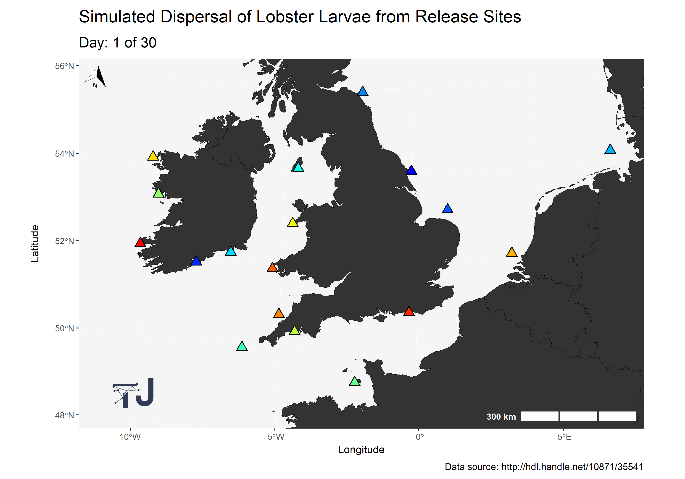
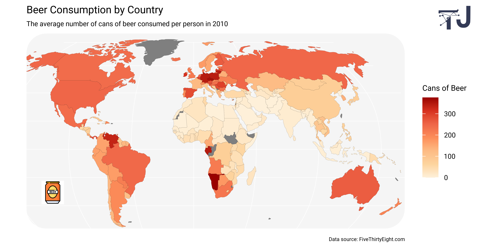
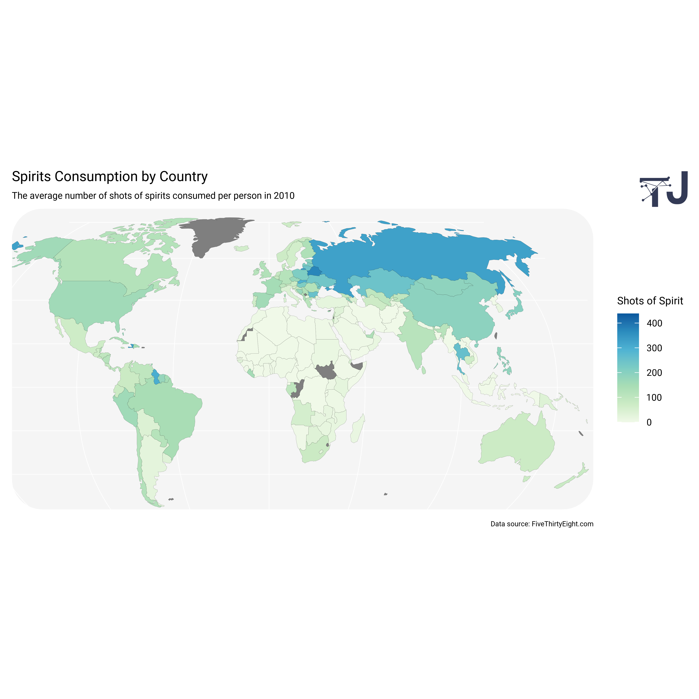
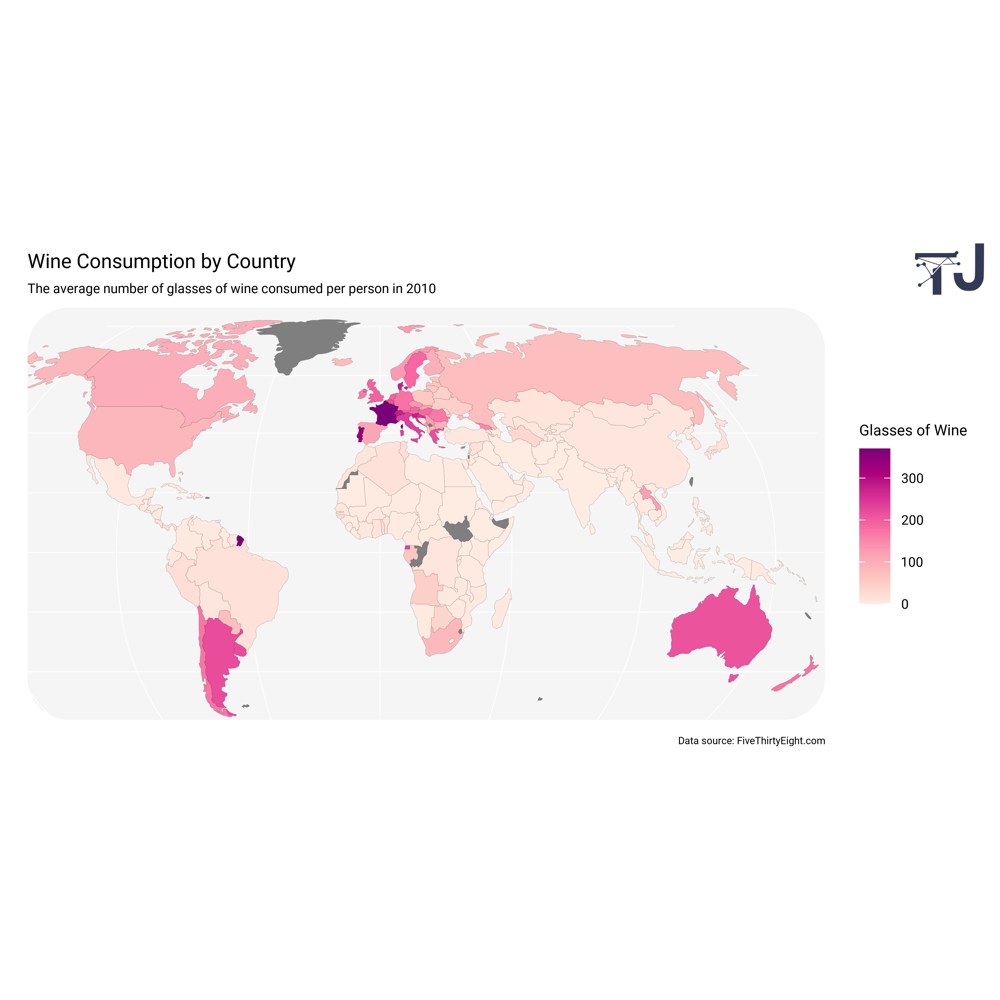
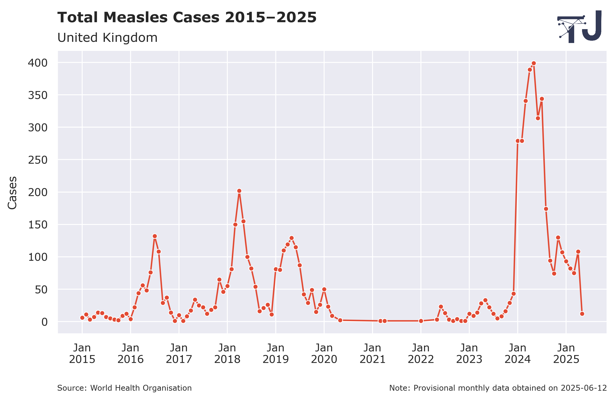

# Data Visualisation

> A collection data visualisations created using R, Python and JavaScript.

## Table of Contents

- [Lobster Larvae Dispersal](#lobster-larvae-dispersal)
- [Global Alcohol Consumption](#global-alcohol-consumption)
- [UK Measles Cases](#uk-measles-cases)

## Lobster Larvae Dispersal

> Programming: R  
> Main packages: `ggplot2` and `gganimate`

[Back to Contents](#table-of-contents)

## Global Alcohol Consumption

> Programming: R  
> Main packages: `ggplot2` and `rnaturalearth`

[Back to Contents](#table-of-contents)

## UK Measles Cases

> Programming: Python  
> Main libraries: `Matplotlib` and `Seaborn`

[Back to Contents](#table-of-contents)
