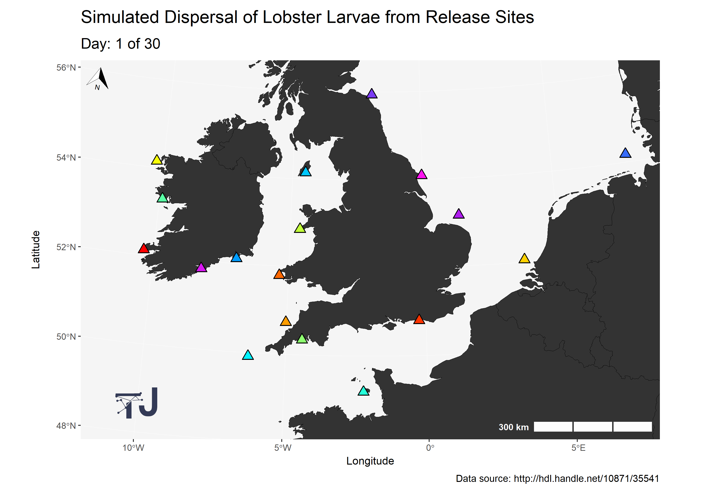

# Data Visualisation

> A collection data visualisations created using R, Python and JavaScript.

## Table of Contents

- [Lobster Larvae Dispersal](#lobster-dispersal)
- [Europe Alcohol Consumption](#alcohol-consumption)
- [UK Measles Cases](#measles-cases)

## Lobster Larvae Dispersal

> Programming: R  
> Main packages: `ggplot2` and `gganimate`

## Europe Alcohol Consumption

> Programming: R  
> Main package: `ggplot2`

## UK Measles Cases

> Programming: Python  
> Main libraries: `Matplotlib` and `Seaborn`

